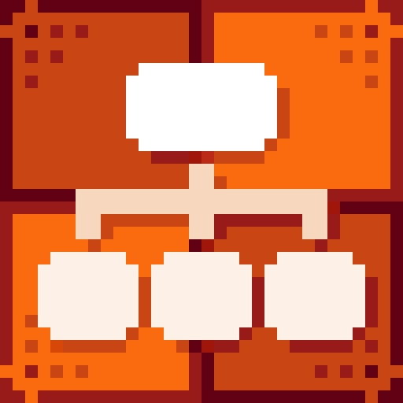

# Advanced Time Choice

<figure><figcaption>
Icon
</figcaption></figure> <figure><figcaption>
Dialogue Start in Dialogue Editor
</figcaption></figure>


#### This Featureis available only in the **Pro Version**

This is one of many features available exclusively in the **Pro** version. To learn more about all the exclusive functionalities of **Pro Version**, check out this comparison: [\[Version Difference\]](../../getting-started/quickstart.md)


Advance Time Choice is a node that allows for the creation of advanced, time-limited dialogue options, which are displayed based on specific conditions. Additionally, responses can be marked with different types, enabling more dynamic and interactive conversations. If the player does not make a choice before the time expires, a default action or the Time Out path will be executed.

If none of the available choices meet their condition, the node linked to **No Choice Available** will be triggered, ensuring an alternative dialogue flow.

### Value Description

<table><thead><tr><th width="203" align="center">Value</th><th align="center">Description</th></tr></thead><tbody><tr><td align="center">Decision Time</td><td align="center">Defines the time limit for the player to make a decision. If no choice is made before the time expires, the Time Out path will be executed automatically.</td></tr><tr><td align="center">Show Timer</td><td align="center">Determines whether a countdown timer should be displayed on the screen while time is running out for making a decision.</td></tr></tbody></table>

### Advance Choice Options

<table><thead><tr><th width="203" align="center">Value</th><th align="center">Description</th></tr></thead><tbody><tr><td align="center">Type</td><td align="center">Allows for defining the response type, making it possible to highlight key dialogue choices relevant to the story and various special behaviors, such as unique character reactions or alternative dialogue paths.</td></tr><tr><td align="center">Content</td><td align="center">Specifies the content displayed for a given choice option.</td></tr><tr><td align="center">Condition</td><td align="center">Defines the condition that must be met for the response to appear in the game.</td></tr></tbody></table>
