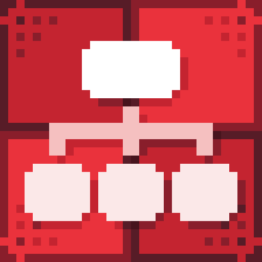

# Dialogue End

<figure><figcaption>
Icon
</figcaption></figure> <figure><figcaption>
Dialogue Start in Dialogue Editor
</figcaption></figure>

Dialogue End is a node that defines the end of a dialogue. It is required in every dialogue. Each ending can have a different behavior.

### Value Description

<table><thead><tr><th width="140">Version<select><option value="q61LGWc31ps3" label="Pro Only" color="blue"></option><option value="JI4hjq2wdjYx" label="Free &#x26; Pro" color="blue"></option></select></th><th width="203" align="center">Value</th><th align="center">Description</th></tr></thead><tbody><tr><td>Free &#x26; Pro</td><td align="center">Dialogue End Type</td><td align="center">Defines the behavior that will be executed when the dialogue ends.</td></tr><tr><td>Pro Only</td><td align="center">Dialogue SO</td><td align="center">Defines the next dialogue that will start when the current dialogue ends.</td></tr><tr><td>Pro Only</td><td align="center">Start ID</td><td align="center">An optional field that defines an ID used to find the appropriate starting point. If the ID exists in the next dialogue, the dialogue will start from that ID. If not, or if the field is empty, a random starting point will be used.</td></tr></tbody></table>

### Dialogue End Types

<table><thead><tr><th width="140">Version<select><option value="q61LGWc31ps3" label="Pro Only" color="blue"></option><option value="JI4hjq2wdjYx" label="Free &#x26; Pro" color="blue"></option></select></th><th width="203" align="center">Value</th><th align="center">Description</th></tr></thead><tbody><tr><td>Free &#x26; Pro</td><td align="center">End</td><td align="center">Ends the dialogue without any additional functionality.</td></tr><tr><td>Free &#x26; Pro</td><td align="center">Return to Start</td><td align="center">Restarts the same dialogue from a selected or random starting point.</td></tr><tr><td>Pro Only</td><td align="center">Next Dialogue</td><td align="center">Starts a selected dialogue from a chosen or random starting point.</td></tr></tbody></table>
