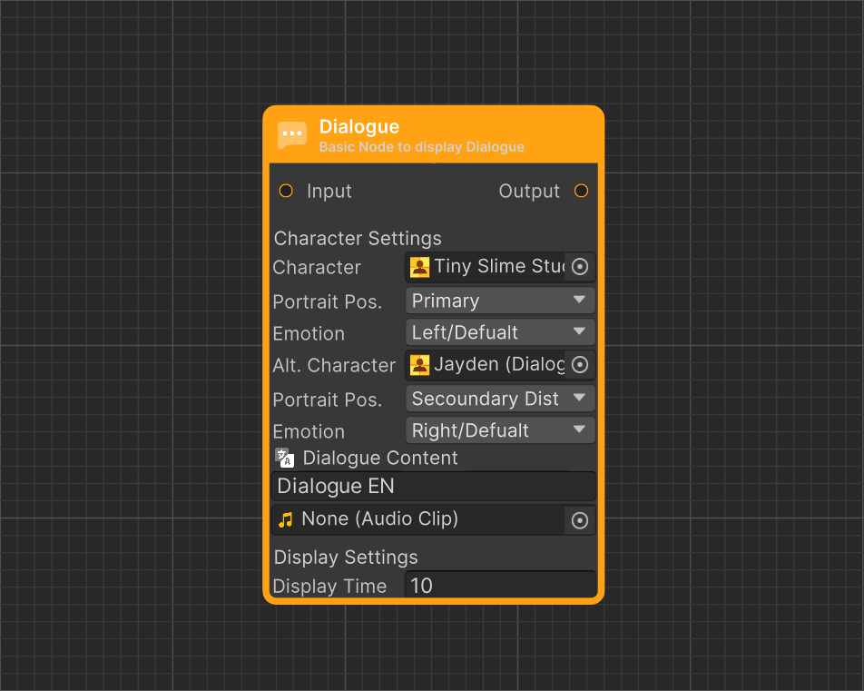

# Dialogue Node

<figure><figcaption>
Icon
</figcaption></figure> <figure><figcaption>
Dialogue Start in Dialogue Editor
</figcaption></figure>

Dialogue Node is the primary node for displaying text in a dialogue and is likely the most frequently used node.

### Value Description

<table><thead><tr><th width="140">Version<select><option value="q61LGWc31ps3" label="Pro Only" color="blue"></option><option value="JI4hjq2wdjYx" label="Free &#x26; Pro" color="blue"></option></select></th><th width="203" align="center">Value</th><th align="center">Description</th></tr></thead><tbody><tr><td>Pro Only</td><td align="center">Charactrer</td><td align="center">Character used to define the person speaking in the dialogue.</td></tr><tr><td>Pro Only</td><td align="center">Portrait Position</td><td align="center">Specifies the position where the main character's avatar will be displayed.</td></tr><tr><td>Pro Only</td><td align="center">Emotion</td><td align="center">Allows selecting one of the emotions available for the main character.</td></tr><tr><td>Pro Only</td><td align="center">Secound Character</td><td align="center">Defines an additional character that can be displayed in the dialogue.</td></tr><tr><td>Pro Only</td><td align="center">Secound Portrait Position</td><td align="center">Specifies the position where the additional character's avatar will be displayed.</td></tr><tr><td>Pro Only</td><td align="center">Secound Emotion</td><td align="center">Allows selecting one of the emotions available for the additional character.</td></tr><tr><td>Free &#x26; Pro</td><td align="center">Dialogue Content</td><td align="center">Defines the text displayed during the dialogue, supports Rich Text.</td></tr><tr><td>Free &#x26; Pro</td><td align="center">Dialogue Audio</td><td align="center">Specifies the audio file played during the dialogue</td></tr><tr><td>Free &#x26; Pro</td><td align="center">Duration</td><td align="center">Determines the time after which the dialogue moves to the next node. If set to 0, manual progression to the next node is required.</td></tr></tbody></table>
