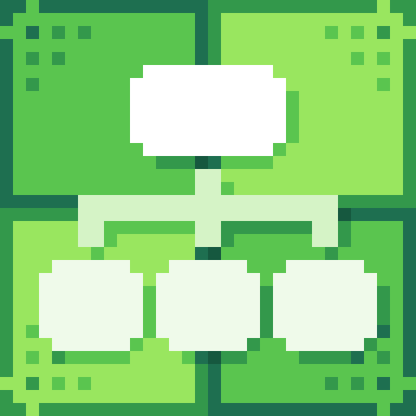
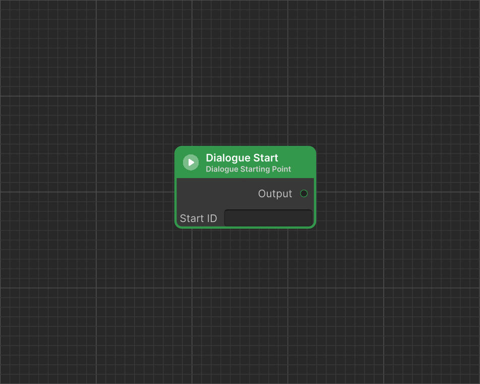

# Dialogue Start

<figure><figcaption>
Icon
</figcaption></figure> <figure><figcaption>
Node in Dialogue Editor
</figcaption></figure>

Dialogue Start is a node that defines the starting point of a dialogue. It is required in every dialogue. If a dialogue contains more than one Dialogue Start, it allows selecting or randomly determining the starting point.

### Value Description

<table><thead><tr><th width="126">Version<select><option value="q61LGWc31ps3" label="Pro Only" color="blue"></option><option value="JI4hjq2wdjYx" label="Free &#x26; Pro" color="blue"></option></select></th><th width="203" align="center">Value</th><th align="center">Description</th></tr></thead><tbody><tr><td>Pro Only</td><td align="center">Start ID</td><td align="center">A value used to define an ID that can be used to start the dialogue from the appropriate point.</td></tr></tbody></table>
