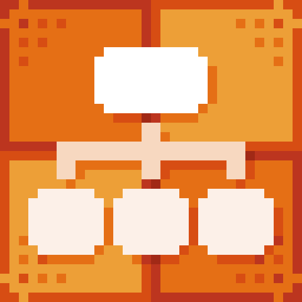
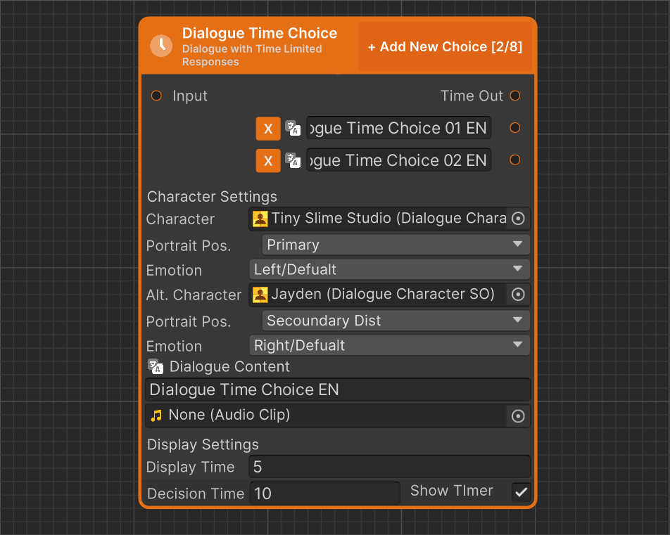

# Dialogue Time Choice

<figure><figcaption>
Icon
</figcaption></figure> <figure><figcaption>
Dialogue Start in Dialogue Editor
</figcaption></figure>


#### This Featureis available only in the **Pro Version**

This is one of many features available exclusively in the **Pro** version. To learn more about all the exclusive functionalities of **Pro Version**, check out this comparison: [\[Version Difference\]](../../getting-started/quickstart.md)


Dialogue Time Choice is a variant of the Dialogue Choice node that includes a countdown timer for making a decision. If the player does not choose within the given time, a default action will be executed automatically.

### Value Description

<table><thead><tr><th width="203" align="center">Value</th><th align="center">Description</th></tr></thead><tbody><tr><td align="center">Charactrer</td><td align="center">Character used to define the person speaking in the dialogue.</td></tr><tr><td align="center">Portrait Position</td><td align="center">Specifies the position where the main character's avatar will be displayed.</td></tr><tr><td align="center">Emotion</td><td align="center">Allows selecting one of the emotions available for the main character.</td></tr><tr><td align="center">Secound Character</td><td align="center">Defines an additional character that can be displayed in the dialogue.</td></tr><tr><td align="center">Secound Portrait Position</td><td align="center">Specifies the position where the additional character's avatar will be displayed.</td></tr><tr><td align="center">Secound Emotion</td><td align="center">Allows selecting one of the emotions available for the additional character.</td></tr><tr><td align="center">Dialogue Content</td><td align="center">Defines the text displayed during the dialogue, supports Rich Text.</td></tr><tr><td align="center">Dialogue Audio</td><td align="center">Specifies the audio file played during the dialogue</td></tr><tr><td align="center">Display Time</td><td align="center">Defines the time delay between displaying the dialogue text and showing the available choices. This allows for better control over the conversation flow.</td></tr><tr><td align="center">Decision Time</td><td align="center">Defines the time limit for the player to make a decision. If no choice is made before the time expires, the Time Out path will be executed automatically.</td></tr><tr><td align="center">Show Timer</td><td align="center">Determines whether a countdown timer should be displayed on the screen while time is running out for making a decision.</td></tr></tbody></table>

### Choice Options

Dialogue Time Choice uses basic responses that are always displayed. It allows for the creation of selectable options that appear after a set time, guiding the player through multiple dialogue paths and influencing the conversation’s progression.
