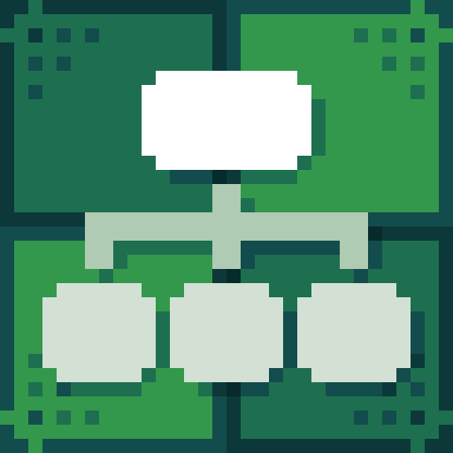

# Editor Notes

<figure><figcaption>
Icon
</figcaption></figure> <figure><figcaption>
Dialogue Start in Dialogue Editor
</figcaption></figure>


#### This Featureis available only in the **Pro Version**

This is one of many features available exclusively in the **Pro** version. To learn more about all the exclusive functionalities of **Pro Version**, check out this comparison: [\[Version Difference\]](../../getting-started/quickstart.md)


Editor Notes is a node that allows adding comments within the dialogue editor. It can be used to describe specific sections, plan the conversation structure, and highlight important details for future editing. This helps improve the clarity and organization of complex dialogues, making them easier to manage and refine.

### Value Description

<table><thead><tr><th width="203" align="center">Value</th><th align="center">Description</th></tr></thead><tbody><tr><td align="center">Context</td><td align="center">The content that will be displayed in Editor Notes, used for describing, organizing, and planning the dialogue structure</td></tr></tbody></table>
