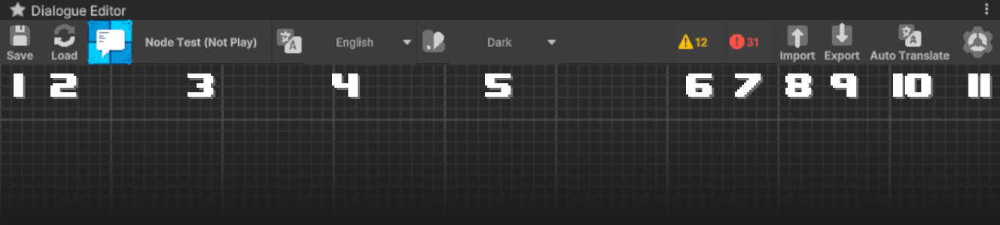

# Dialogue Editor

To open the **Dialogue Editor**, simply double-click on the selected dialogue. This will open the editor window where you can make changes and manage the dialogue's structure.


### Saving Dialogues Before Play Mode to Prevent Data Loss

Dialogues cannot be edited during **Play Mode**, so it is recommended to save the dialogue before entering play mode. Failing to save before entering **Play Mode** may result in the loss of unsaved progress after exiting the play mode.


<figure><figcaption></figcaption></figure>

### 1. Toolbar

<figure><figcaption>
Dialogue Editor | Toolbar
</figcaption></figure>

<table data-header-hidden><thead><tr><th width="43" align="center"></th><th width="186" align="center"></th><th align="center"></th></tr></thead><tbody><tr><td align="center">1</td><td align="center">Save Button</td><td align="center">Allows saving the current work progress.</td></tr><tr><td align="center">2</td><td align="center">Load Buttom</td><td align="center">Enables loading the last saved progress.</td></tr><tr><td align="center">3</td><td align="center">Dialogue Name</td><td align="center">Displays the name of the file being edited.</td></tr><tr><td align="center">4</td><td align="center">Language Selector</td><td align="center">Allows choosing the currently edited language.</td></tr><tr><td align="center">5</td><td align="center">Theme Selector</td><td align="center">Enables selecting the editor theme.</td></tr><tr><td align="center">6</td><td align="center">Warning Indicator</td><td align="center">Displays the number of warnings occurring in the dialogue.</td></tr><tr><td align="center">7</td><td align="center">Error Indicator</td><td align="center">Displays the number of errors occurring in the dialogue.</td></tr><tr><td align="center">8</td><td align="center">Import Button</td><td align="center">Allows importing a CSV file containing dialogue translations.  <a href="../../how-to/import-export-csv-localization-file.md#how-to-load-a-csv-file-with-translations">[Documentation] </a> <a data-footnote-ref href="#user-content-fn-1"><mark style="color:blue;">[Available only in the <strong>Pro Version]</strong></mark></a></td></tr><tr><td align="center">9</td><td align="center">Export Button</td><td align="center">Allows exporting a CSV file containing dialogue translations.   <a href="../../how-to/import-export-csv-localization-file.md#how-to-generate-a-csv-file-with-translations">[Documentation] </a> <a data-footnote-ref href="#user-content-fn-1"><mark style="color:blue;">[Available only in the <strong>Pro Version]</strong></mark></a></td></tr><tr><td align="center">10</td><td align="center">Auto Translate Button</td><td align="center">Allows automatic translation of the dialogue using an API.   [Documentation] <a data-footnote-ref href="#user-content-fn-1"><mark style="color:blue;">[Available only in the <strong>Pro Version]</strong></mark></a></td></tr><tr><td align="center">11</td><td align="center">Settings Button</td><td align="center">Allows expanding dialogue settings.</td></tr></tbody></table>

### 2. Dialogue Settings

Pressing the **Settings** button in the top right corner will display a list of settings divided into two sections:

#### Editor Settings

A list of fundamental global settings for the dialogue editor. Changing these settings will automatically update the main **Meet and Talk** settings.

#### Dialogue Settings

A list of settings specific to the current dialogue, allowing customization and management of its behavior according to user preferences.

### 3. Search Window

The **Search Window** can be opened by right-clicking on the editor grid and selecting **Create Node**. This window allows for quickly adding new nodes to a dialogue.

A new node can be added in two ways:

* **Searching** – by typing the name of a specific node in the search bar.
* **Browsing categories** – by selecting a node from a categorized list based on its functionality.

This feature makes it easier to find and add the necessary nodes, streamlining the dialogue creation process.

[^1]: This is one of many features available exclusively in the **Pro** version. To learn more about all the exclusive functionalities of **Pro Version**, check out this comparison: [\[Version Difference\]](https://tiny-slime-studio.gitbook.io/meet-and-talk/getting-started/quickstart)
