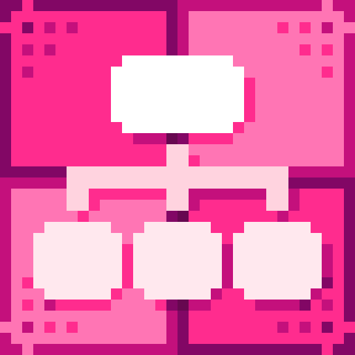
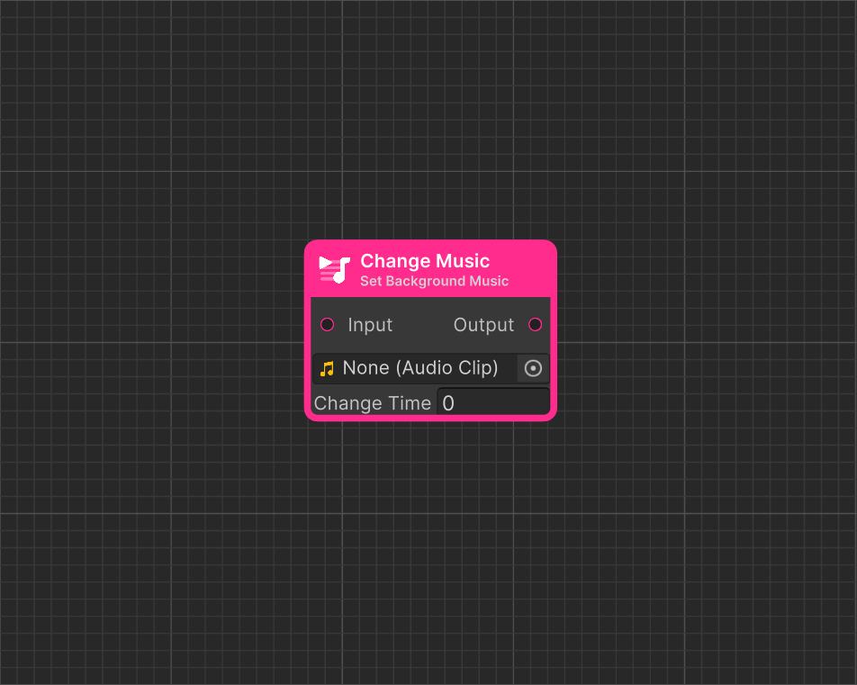

# Change Music

<figure><figcaption>
Icon
</figcaption></figure> <figure><figcaption>
Dialogue Start in Dialogue Editor
</figcaption></figure>


#### This Featureis available only in the **Pro Version**

This is one of many features available exclusively in the **Pro** version. To learn more about all the exclusive functionalities of **Pro Version**, check out this comparison: [\[Version Difference\]](../../getting-started/quickstart.md)


**Music Node** allows changing the background music during a dialogue.

### Value Description

<table><thead><tr><th width="203" align="center">Value</th><th align="center">Description</th></tr></thead><tbody><tr><td align="center">Music</td><td align="center"><strong>Specifies the audio</strong> that will play after the node is executed.</td></tr><tr><td align="center">Change Time</td><td align="center">Determining how smoothly the current audio fades into the new one.</td></tr></tbody></table>
