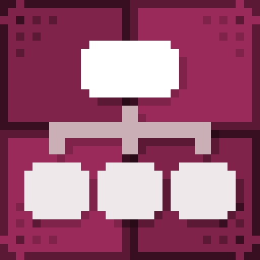
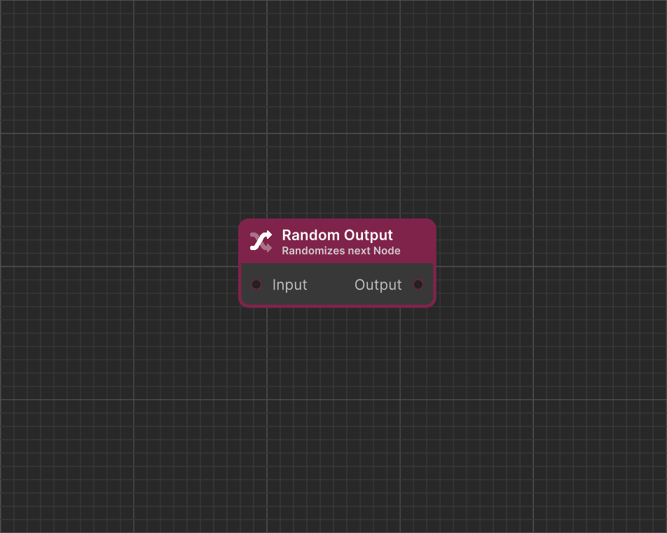

# Random Output

<figure><figcaption>
Icon
</figcaption></figure> <figure><figcaption>
Dialogue Start in Dialogue Editor
</figcaption></figure>


#### This Featureis available only in the **Pro Version**

This is one of many features available exclusively in the **Pro** version. To learn more about all the exclusive functionalities of **Pro Version**, check out this comparison: [\[Version Difference\]](../../getting-started/quickstart.md)



#### **Random Node** has been significantly changed in update **2.0.0a**.

Starting from **2.0.0a**, **Random Node** no longer has a list of **Outputs** where nodes were connected individually. Instead, it now features **a single port**, allowing multiple nodes to be connected at once.


**Random Output** randomly selects and executes one of the connected nodes.
