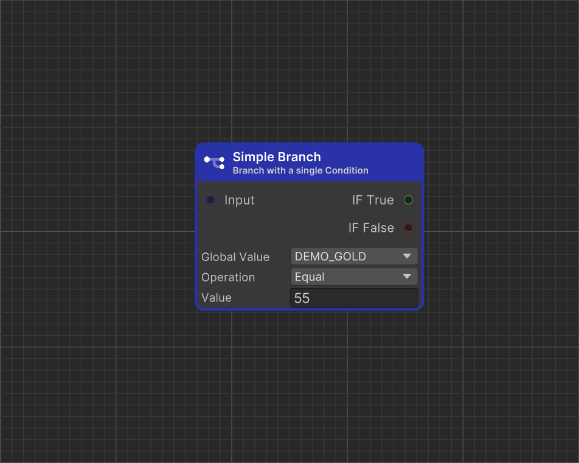

# Simple Branch

<figure><figcaption>
Icon
</figcaption></figure> <figure><figcaption>
Dialogue Start in Dialogue Editor
</figcaption></figure>


#### This Featureis available only in the **Pro Version**

This is one of many features available exclusively in the **Pro** version. To learn more about all the exclusive functionalities of **Pro Version**, check out this comparison: [\[Version Difference\]](../../getting-started/quickstart.md)


**Simple Branch** allows selecting a dialogue path based on whether a specified condition is met.

### Value Description

<table><thead><tr><th width="203" align="center">Value</th><th align="center">Description</th></tr></thead><tbody><tr><td align="center">Global Value</td><td align="center"><strong>Global Value</strong> that serve as the left side of the condition.</td></tr><tr><td align="center">Operation</td><td align="center"><strong>Operation</strong> that can be performed on both values.</td></tr><tr><td align="center">Value</td><td align="center"><strong>A value</strong> that serves as the right side of the equation</td></tr></tbody></table>
