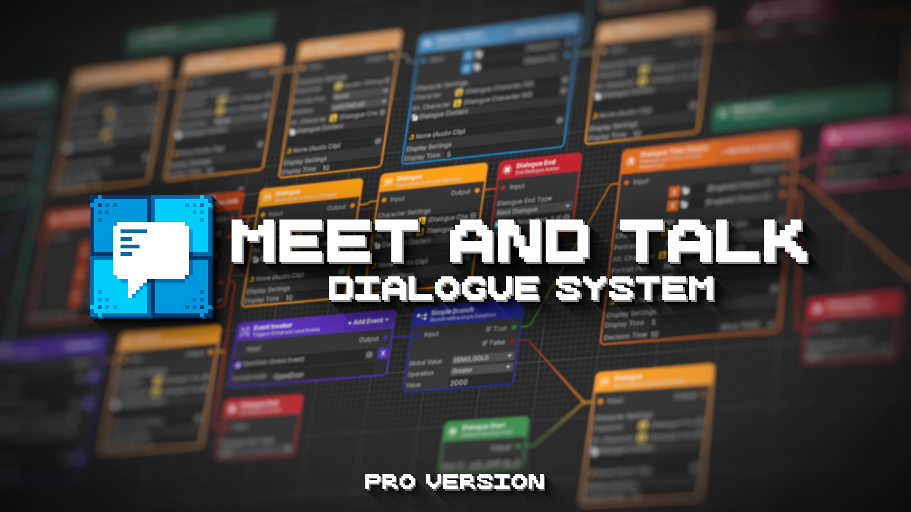

# Installation



### Open / Create Project 

Open or create a new unity project, version 2021.3+

<figure><figcaption>
Unity Hub Version 3.11
</figcaption></figure>




### Open Package Manager 

From the toolbar, select `Window -> Package Manager` to open the Package Manager

<figure><figcaption>
Unity Edtior 2021.3.17f
</figcaption></figure>



### Install Package 

From Droplist Packages: select `My Assets` and search `Meet and Talk`, download and install

<figure><figcaption>
Package Manager from Unity Editor 2021.3.17f
</figcaption></figure>



