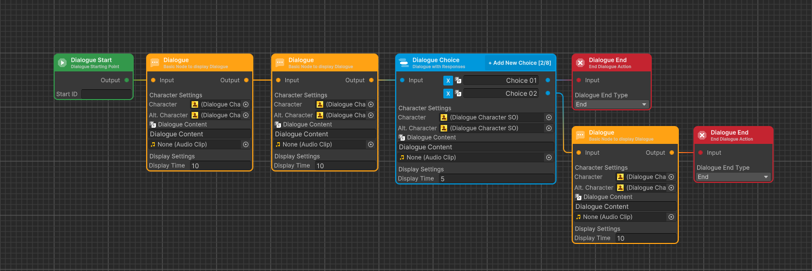

# Create New Dialogue



### Crate Dialogue Container SO

In the Hierarchy tab, right-click, in the pop-up window hover over the <mark style="color:blue;">Create</mark> option, hover over the <mark style="color:blue;">Dialogue</mark> option and click <mark style="color:blue;">New Dialogue</mark>



### Open Dialogue Editor

Double-click on the created dialogue to edit it



### Edit Dialogue in Editor

You will open the dialog editing window, at the beginning you must add start Node, and at the end of the dialog you must give end node&#x20;


You can have more than one end of the dialog and at each end you must give end node




### Save Dialogue

At the End you have to write the changes in the Dialog in the upper left corner of the editor


In Editor Settings, you can enable Autosave, removing the need to manually save changes and ensuring they are automatically stored




### Sample Dialogue

<figure><figcaption></figcaption></figure>

