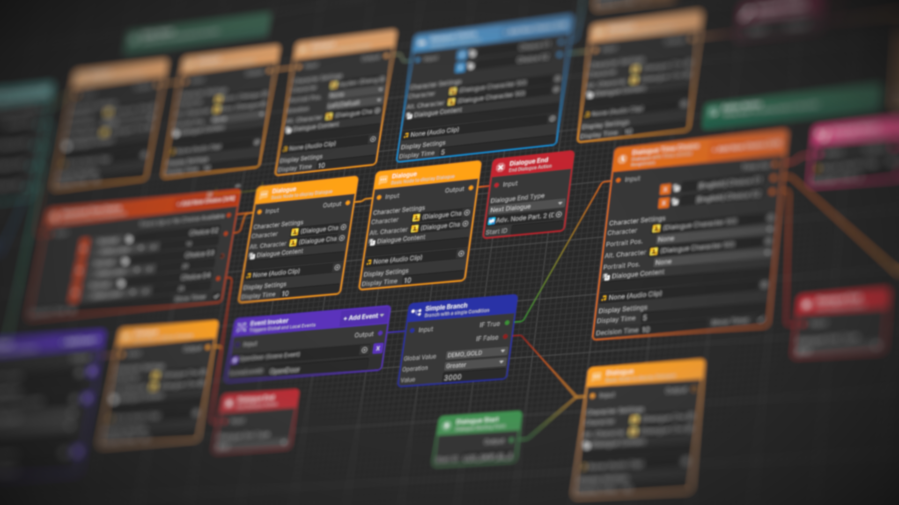

# Setup Global Value

To open Global Value Manager, go to **Edit -> Project Settings** and then find the tab **Meet and Talk -> Global Value Manager**

<figure><figcaption></figcaption></figure>


### Coming Soon

This part of the Documentation will soon appear


