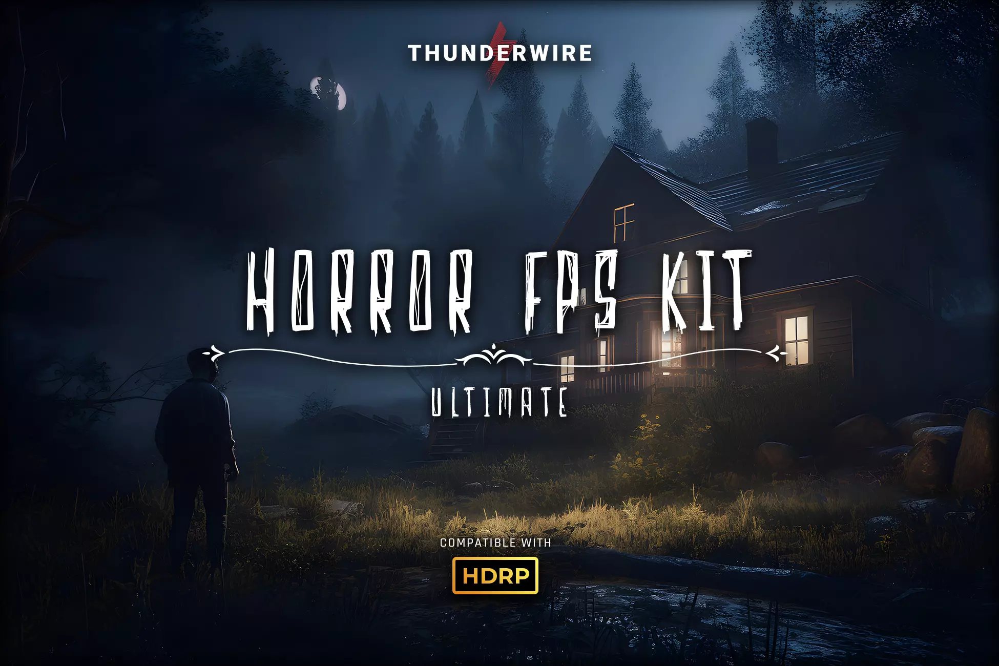

# More Assets

<figure><figcaption></figcaption></figure>

## Hellish Battle - 2.5D Retro FPS

Hellish Battle is modeled on classics such as Doom (1993), Wolfenstein 3D (1992). It takes the best of the old classics, and adds elements from the latest FPS.



***

<table data-view="cards" data-full-width="false"><thead><tr><th align="center"></th><th><select><option value="VYGISRBG9RMD" label="Free" color="blue"></option><option value="VlSDS165GKHv" label="9.99$" color="blue"></option><option value="rAqdaynacb5u" label="4.99$" color="blue"></option></select></th><th data-hidden data-card-cover data-type="files"></th></tr></thead><tbody><tr><td align="center">Hellish Battle 2.5D Retro FPS</td><td>9.99$</td><td><a href=".gitbook/assets/MAT_Pro.png">MAT_Pro.png</a></td></tr><tr><td align="center">Draw the Line Game Template</td><td>4.99$</td><td><a href=".gitbook/assets/MAT_Pro.png">MAT_Pro.png</a></td></tr><tr><td align="center">Loot Table Universal Loot System</td><td>Free</td><td><a href=".gitbook/assets/MAT_Pro.png">MAT_Pro.png</a></td></tr></tbody></table>
